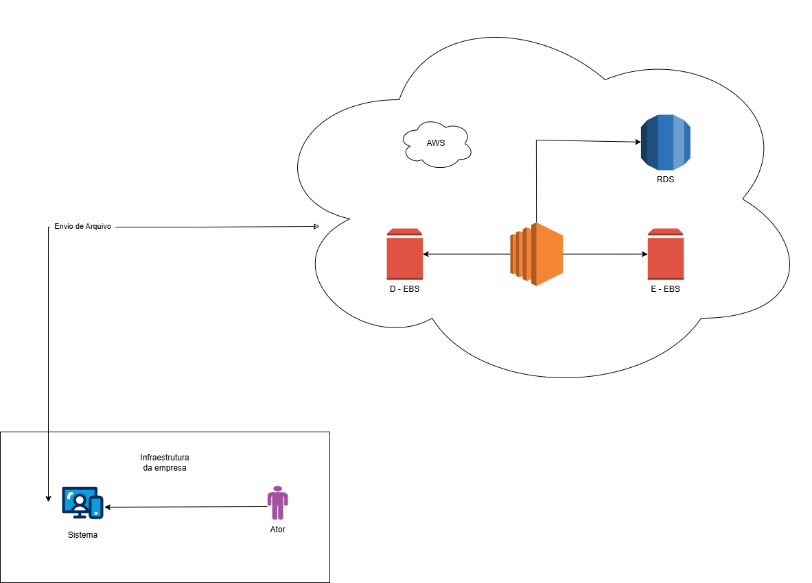

# 🚀 AWS EC2 Lab - Gerenciamento de Instâncias na AWS

> Projeto desenvolvido para explorar os principais recursos do Amazon EC2, incluindo criação, configuração, monitoramento e gerenciamento de servidores virtuais na nuvem.


---

## 📌 Sobre o Projeto

Este laboratório teve como objetivo explorar os principais recursos do **Amazon EC2 (Elastic Compute Cloud)**, permitindo a criação, configuração, monitoramento e gerenciamento de servidores virtuais na nuvem.

---

## 🎯 Objetivos

* ✅ Criar e configurar instâncias EC2
* ✅ Configurar Security Groups
* ✅ Realizar acesso remoto via SSH
* ✅ Monitorar recursos utilizando CloudWatch
* ✅ Aplicar boas práticas de segurança
* ✅ Documentar todo o processo utilizando GitHub

---
## 🖼️ Diagrama da Arquitetura


## 🏗️ Arquitetura

```text
┌──────────────┐
│   Usuário    │
└──────┬───────┘
       │
       ▼
┌──────────────┐
│ Internet     │
└──────┬───────┘
       │
       ▼
┌─────────────────────┐
│ Security Group      │
│ SSH | HTTP | HTTPS  │
└──────┬──────────────┘
       │
       ▼
┌─────────────────────┐
│ Amazon EC2          │
│ Ubuntu Server       │
└──────┬──────────────┘
       │
       ▼
┌─────────────────────┐
│ Amazon CloudWatch   │
└─────────────────────┘
```

---

## 🔧 Configurações da Instância

| Configuração        | Valor         |
| ------------------- | ------------- |
| Sistema Operacional | Ubuntu Server |
| Tipo da Instância   | t2.micro      |
| Região              | us-east-1     |
| Armazenamento       | 8 GB SSD      |
| Chave SSH           | RSA           |

---

## 🔒 Segurança

| Porta | Protocolo | Função |
| ----- | --------- | ------ |
| 22    | TCP       | SSH    |
| 80    | TCP       | HTTP   |
| 443   | TCP       | HTTPS  |

### Boas Práticas

* Restringir acesso SSH por IP específico
* Utilizar autenticação por chave privada
* Evitar portas desnecessárias abertas
* Aplicar o princípio do menor privilégio

---

## 💻 Conexão SSH

Comando utilizado:

```bash
ssh -i chave.pem ubuntu@IP_PUBLICO
```

Resultado esperado:

```bash
Welcome to Ubuntu Server
```

---

## 📊 Monitoramento CloudWatch

Os seguintes recursos foram monitorados:

* Uso de CPU
* Tráfego de Rede
* Utilização de Disco
* Status da Instância
* Alarmes e Eventos

---

## 📈 Insights Obtidos

Durante o laboratório foi possível compreender como a computação em nuvem permite provisionar infraestrutura rapidamente, eliminando a necessidade de aquisição de hardware físico.

Além disso, ficou evidente a importância da segurança na configuração dos Security Groups e do monitoramento contínuo utilizando o Amazon CloudWatch.

---

## 🧠 Conceitos Aprendidos

### Amazon EC2

Serviço de computação em nuvem da AWS que fornece servidores virtuais sob demanda.

### AMI (Amazon Machine Image)

Imagem utilizada para criar instâncias EC2.

### Security Group

Firewall virtual responsável pelo controle de tráfego de entrada e saída.

### Key Pair

Par de chaves utilizado para autenticação segura via SSH.

### Elastic IP

Endereço IP público fixo associado à instância.

### CloudWatch

Serviço de monitoramento e observabilidade da AWS.

---

## 📂 Estrutura do Projeto

```text
aws-ec2-lab/
│
├── README.md
├── index.html
│
├── css/
│   └── style.css
│
├── images/
│   ├── aws-ec2-banner.png
│   ├── dashboard-aws.png
│   ├── instancia-ec2.png
│   ├── security-group.png
│   └── conexao-ssh.png
│
└── docs/
    ├── configuracao-ec2.md
    ├── monitoramento.md
    ├── seguranca.md
    └── troubleshooting.md
```

---

## 🛠️ Ferramentas Utilizadas

### AWS

* Amazon EC2
* Amazon CloudWatch
* IAM
* Security Groups

### Desenvolvimento

* Git
* GitHub
* Visual Studio Code
* Draw.io

---

## 📚 Referências

* AWS EC2 Documentation
* AWS CloudWatch Documentation
* GitHub Docs
* AWS Training & Certification

---

## 👨‍💻 Autor

### Gabriel Monteiro

**Estudante de Engenharia | Dados | Inteligência Artificial | Cloud Computing**

### Conecte-se comigo

* GitHub: https://github.com/seu-usuario
* LinkedIn: https://linkedin.com/in/seu-perfil

---

## ⭐ Conclusão

Ao concluir este laboratório, foi possível compreender o ciclo completo de gerenciamento de instâncias EC2, desde o provisionamento até o monitoramento dos recursos.

O projeto serviu como base para aprofundar conhecimentos em Cloud Computing, DevOps, Infraestrutura como Serviço (IaaS) e arquitetura AWS.
